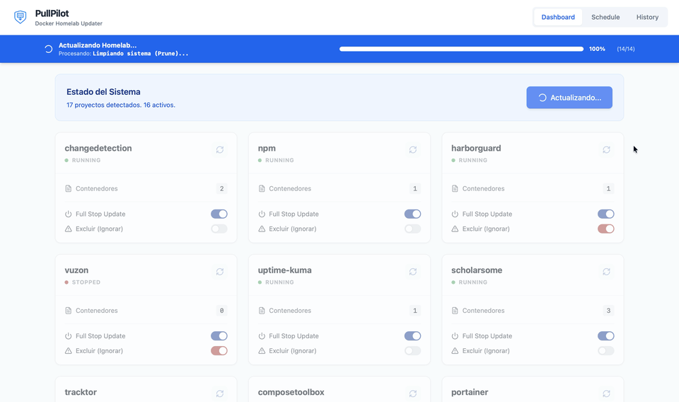

<p align="center">
  
</p>

<div align="center">

<h3>
  <a href="#english">English</a> | <a href="#español">Español</a>
</h3>

<p align="center">
  <a href="https://github.com/KN990x/PullPilot/stargazers">
    
  </a>
  &nbsp;
  <a href="https://github.com/KN990x/PullPilot/issues">
    
  </a>
  &nbsp;
  <a href="./LICENSE">
    
  </a>
  &nbsp;
  
</p>

<p align="center">
  
  &nbsp;
  
  &nbsp;
  
</p>

</div>

<p align="center">
  
</p>


---

<a name="english"></a>
# PullPilot

PullPilot is an app aimed at homelab and personal deployments. It lets you manage updates for your Docker images and services (status, logs, deployment modes) from a single UI.

## Quick install

```bash
sudo mkdir -p /srv/docker-stacks
mkdir -p ~/pullpilot && cd ~/pullpilot
curl -fsSL -o docker-compose.yml https://raw.githubusercontent.com/KN990x/PullPilot/main/docker-compose.yml
docker compose up -d
```

Open **http://your-server-ip:8000**. That is the whole installation.

**First run:** the browser shows a setup wizard. Pick a username and a password, type the password twice, and you are in. The credentials are stored hashed (scrypt) in PullPilot's own database and the session signing secret is generated and persisted automatically — **there is nothing to configure and no secret to put in a file**.

**There is no `.env` to create.** PullPilot ships with working defaults; you only add one if you want to change the stacks path, the port, the timezone, or you are behind a reverse proxy. Four variables, all optional — see [Configuration](#configuration).

> Between the first start and completing the wizard, anyone who can reach the instance can claim it. Complete the wizard right away and do not publish the port before you have. See [SECURITY.md](./SECURITY.md).

## After startup

- **Different stacks location:** create the folder on the host, then add `.env` next to `docker-compose.yml` with **`STACKS_PATH=/absolute/path/to/stacks`** (same path on host and in the container). After any `.env` change, run `docker compose up -d`.
- **Layout:** each project is a **subfolder** under that root with `docker-compose.yml` or `docker-compose.yaml` inside. Keep PullPilot’s compose folder **outside** that tree when you can.

```
/srv/docker-stacks/          # default STACKS_PATH
├── plex/
│   └── docker-compose.yml
└── ...
```

> Folders named `pullpilot`, `pullpilot-ui`, `docker-updater`, and `data` are ignored under the stacks root.

**Cloned repo (development):** use [`docker-compose.yml`](./docker-compose.yml) from the tree; the four optional variables are documented in [`.env.example`](./.env.example).

## Usage Guide

- **Dashboard:** cards per project; status, per-project update, **Full stop** and **Exclude** toggles.
- **Update All:** scans non-excluded projects, `git pull` where applicable, recreates containers; summary in **History**.
- **Exclude:** means *never update this automatically*. It is skipped by Update All, its per-project update button is disabled, and a scheduled task pointing at it will not run. Only removing the toggle brings it back.
- **Schedule:** create cron or one-off tasks per project, or for everything at once. There is no schedule until you create one; the form suggests 04:00. Cron times follow the container clock (`TZ`); a one-off task keeps the timezone of the browser that created it. A schedule is refused if its target does not exist, is excluded, or would duplicate one you already have — the list only ever holds tasks that can actually run.

## Local development (contributors)

```bash
git clone https://github.com/KN990x/PullPilot
cd PullPilot
docker compose -f docker-compose-build.yml up -d --build
```

Day-to-day: `make dev` runs the backend and the Vite dev server together (see [`Makefile`](./Makefile)).

## Important notes

- **GHCR image:** the published image is `ghcr.io/kn990x/pullpilot`. If you still pin `ghcr.io/kernel-nomad/pullpilot`, update your compose file or `docker pull` to the new path.
- **Docker socket:** treat PullPilot like root access; do not expose port 8000 to the public internet without TLS (reverse proxy), a strong password, and ideally an extra auth layer (Authelia, Authentik, etc.).
- **Stack paths:** updates and scheduled jobs only run under `STACKS_PATH` (resolved); database paths outside that tree are rejected.
- **What happens when an update fails:** before pulling, PullPilot records which local
  image each service is currently using. If the deploy or the healthcheck fails it puts
  those tags back, reverts the compose file when the stack is a Git clone, and brings the
  stack up again either way — so a failed update does not leave it down. Two limits worth
  knowing: services built from a `Dockerfile` (`build:`) are rebuilt rather than reverted,
  and an image that had never been pulled on this host has no previous version to go back
  to.
- **Updates run in the background:** both *Update All* and a single-project update answer
  immediately and do the work behind the request; the UI follows them by polling. Nothing
  holds an HTTP connection open for the length of a deploy, so a reverse proxy with a short
  read timeout will not report a working deploy as failed. Each update in flight uses one
  worker thread, and a second update of the *same* stack is refused while the first runs.
- **Single worker:** one Uvicorn worker per instance. The signing secret *is* shared across workers (it lives in a file inside the data volume), but the scheduler, the login rate limit and both the global and per-project update state are per process, so more than one worker means duplicated scheduled updates.
- **Auth:** credentials live hashed in the database and are created through the setup wizard on first run. There is no environment variable that can create, replace or bypass them.
- **Changing the password:** the account button in the header (next to the language switch) changes username and password. Doing so signs out every other device.
- **Password recovery:** there is no automatic reset. Stop the container, delete the stored credentials, and the wizard comes back:
  ```bash
  docker compose stop pullpilot
  docker compose run --rm --no-deps --entrypoint python pullpilot -c \
    "import sqlite3; db=sqlite3.connect('/app/data/pullpilot.db'); db.execute('DELETE FROM auth_credentials'); db.commit()"
  docker compose start pullpilot
  ```
  Anyone able to run that already has the host and therefore the Docker socket, so this is maintenance, not a privilege escalation.
- **`session_secret.key`:** created inside the data volume with mode `0600`, owned by root (the container runs as root). Deleting it just signs everyone out.
- **Reverse proxy:** set `PUBLIC_URL` to the address you actually use, e.g. `https://pullpilot.example.com`. With an `https://` URL the session cookie is marked `Secure` and the login rate limit starts trusting `X-Forwarded-For`. Leave it unset on a plain LAN install.

---

<a name="configuration"></a>
## Configuration

Everything is optional. Copy [`.env.example`](./.env.example) to `.env` next to `docker-compose.yml` only if one of these four needs changing, then `docker compose up -d`.

| Variable | Default | Description |
|----------|---------|-------------|
| `STACKS_PATH` | `/srv/docker-stacks` | Stacks folder: one subfolder per project, each with its `docker-compose.yml`. Bind-mounted at the same absolute path on host and container. |
| `PULLPILOT_PORT` | `8000` | Published host port for the UI. |
| `TZ` | `UTC` | Container timezone — the one scheduled tasks run on. |
| `PUBLIC_URL` | (unset) | Only behind a reverse proxy. An `https://` value marks the session cookie `Secure` and makes the login rate limit read `X-Forwarded-For`. |

Everything that used to be configurable — the session secret, the cookie's `SameSite`, CORS origins, command timeouts, the login rate limit, the static files path — is now either generated automatically or a constant with a sensible value. If you had `DOCKER_ROOT_PATH` or `PROJECTS_ROOT` in an older `.env`, they still work: both are read as aliases of `STACKS_PATH`, in that order of precedence. `DATA_DIR` also exists, but it is internal: the container fixes it to `/app/data` and `make dev-server` points it at `.devdata`. It is not part of the four and there is no reason to set it. (`PULLPILOT_TESTING` is read too, but only by the test suite, to swap SQLite for an in-memory database.)

---

<a name="español"></a>
# PullPilot

PullPilot es una aplicación pensada para desplegarse en homelabs y para uso personal. Permite gestionar actualizaciones de imágenes y servicios Docker (estado, logs, modos de despliegue) desde una sola interfaz.

## Instalación rápida

```bash
sudo mkdir -p /srv/docker-stacks
mkdir -p ~/pullpilot && cd ~/pullpilot
curl -fsSL -o docker-compose.yml https://raw.githubusercontent.com/KN990x/PullPilot/main/docker-compose.yml
docker compose up -d
```

Abre **http://tu-servidor-ip:8000**. Eso es toda la instalación.

**Primer arranque:** el navegador muestra un asistente de configuración. Eliges usuario y contraseña, la repites, y ya estás dentro. Las credenciales se guardan hasheadas (scrypt) en la propia base de datos de PullPilot y el secreto de firma de sesión se genera y persiste solo — **no hay nada que configurar ni ningún secreto que meter en un fichero**.

**No hay ningún `.env` que crear.** PullPilot trae valores por defecto que funcionan; solo añades uno si quieres cambiar la ruta de stacks, el puerto, la zona horaria, o si tienes un proxy inverso delante. Cuatro variables, todas opcionales — véase [Configuración](#configuración).

> Entre el primer arranque y completar el asistente, cualquiera que alcance la instancia puede reclamarla. Complétalo enseguida y no publiques el puerto antes de hacerlo. Véase [SECURITY.md](./SECURITY.md).

## Después del arranque

- **Otra ubicación de stacks:** crea la carpeta en el host y añade `.env` junto a `docker-compose.yml` con **`STACKS_PATH=/ruta/absoluta/a/stacks`** (misma ruta en host y contenedor). Tras cualquier cambio en `.env`, ejecuta `docker compose up -d`.
- **Estructura:** cada proyecto es una **subcarpeta** bajo esa raíz con `docker-compose.yml` o `docker-compose.yaml` dentro. Cuando puedas, mantén la carpeta de compose de PullPilot **fuera** de ese árbol.

```
/srv/docker-stacks/          # STACKS_PATH por defecto
├── plex/
│   └── docker-compose.yml
└── ...
```

> Las carpetas llamadas `pullpilot`, `pullpilot-ui`, `docker-updater` y `data` se ignoran bajo la raíz de stacks.

**Repositorio clonado (desarrollo):** usa el [`docker-compose.yml`](./docker-compose.yml) del árbol; las cuatro variables opcionales están documentadas en [`.env.example`](./.env.example).

## Guía de uso

- **Dashboard:** tarjetas por proyecto; estado, actualización por proyecto, interruptores **Full stop** y **Excluir**.
- **Actualizar todo:** escanea proyectos no excluidos, `git pull` cuando aplique, recrea contenedores; resumen en **Historial**.
- **Excluir:** significa *no actualizar esto automáticamente nunca*. Lo salta Actualizar todo, su botón de actualización queda deshabilitado y una tarea programada que lo apunte no se ejecuta. Solo vuelve quitando el interruptor.
- **Programación:** crea tareas cron o de un solo uso por proyecto, o para todo a la vez. No hay ninguna programación hasta que la creas; el formulario sugiere las 04:00. Las horas de cron van con el reloj del contenedor (`TZ`); una tarea de un solo uso conserva la zona horaria del navegador que la creó. Una programación se rechaza si su objetivo no existe, está excluido o duplicaría una que ya tienes: en la lista solo hay tareas que de verdad se pueden ejecutar.

## Desarrollo local (contribuidores)

```bash
git clone https://github.com/KN990x/PullPilot
cd PullPilot
docker compose -f docker-compose-build.yml up -d --build
```

Día a día: `make dev` levanta el backend y el servidor de Vite a la vez (véase [`Makefile`](./Makefile)).

## Notas importantes

- **Imagen GHCR:** la imagen publicada es `ghcr.io/kn990x/pullpilot`. Si sigues usando `ghcr.io/kernel-nomad/pullpilot`, actualiza el compose o `docker pull` a la nueva ruta.
- **Socket de Docker:** trata PullPilot como acceso de nivel root; no expongas el puerto 8000 a internet pública sin TLS (proxy inverso), una contraseña robusta y, si es posible, otra capa de autenticación (Authelia, Authentik, etc.).
- **Rutas de stacks:** las actualizaciones y tareas programadas solo se ejecutan bajo `STACKS_PATH` (resuelto); las rutas en base de datos fuera de ese árbol se rechazan.
- **Qué pasa cuando una actualización falla:** antes de descargar nada, PullPilot anota qué
  imagen local usa cada servicio. Si falla el despliegue o el healthcheck, devuelve esos
  tags a su sitio, revierte el fichero compose cuando el stack es un clon de Git, y en
  cualquier caso vuelve a levantar el stack — así un fallo no lo deja caído. Dos límites a
  tener presentes: los servicios que se construyen desde un `Dockerfile` (`build:`) se
  reconstruyen en vez de revertirse, y una imagen que nunca se había descargado en este
  host no tiene versión anterior a la que volver.
- **Las actualizaciones corren en segundo plano:** tanto *Actualizar todo* como la
  actualización de un proyecto responden al momento y hacen el trabajo por detrás; la UI
  las sigue por sondeo. Ninguna mantiene abierta una conexión HTTP durante todo el
  despliegue, así que un proxy inverso con un read timeout corto no va a reportar como
  fallido un despliegue que funcionó. Cada actualización en curso ocupa un hilo, y una
  segunda actualización del *mismo* stack se rechaza mientras la primera siga.
- **Un solo worker:** un worker de Uvicorn por instancia. El secreto de firma **sí** se comparte entre workers (vive en un fichero dentro del volumen de datos), pero el scheduler, el límite de intentos de login y el estado de las actualizaciones —global y por proyecto— son por proceso, así que más de un worker significa actualizaciones programadas duplicadas.
- **Autenticación:** las credenciales viven hasheadas en la base de datos y se crean con el asistente en el primer arranque. No hay ninguna variable de entorno capaz de crearlas, sustituirlas ni saltárselas.
- **Cambiar la contraseña:** el botón de cuenta de la cabecera (junto al selector de idioma) cambia usuario y contraseña. Al hacerlo se cierra la sesión en el resto de dispositivos.
- **Recuperación de la contraseña:** no hay reseteo automático. Para el contenedor, borra las credenciales guardadas y el asistente vuelve a salir:
  ```bash
  docker compose stop pullpilot
  docker compose run --rm --no-deps --entrypoint python pullpilot -c \
    "import sqlite3; db=sqlite3.connect('/app/data/pullpilot.db'); db.execute('DELETE FROM auth_credentials'); db.commit()"
  docker compose start pullpilot
  ```
  Quien pueda ejecutar eso ya tiene el host y, por tanto, el socket de Docker: es mantenimiento, no una escalada de privilegios.
- **`session_secret.key`:** se crea dentro del volumen de datos con permisos `0600` y dueño root (el contenedor corre como root). Borrarlo solo cierra la sesión de todo el mundo.
- **Proxy inverso:** define `PUBLIC_URL` con la dirección por la que entras de verdad, p. ej. `https://pullpilot.example.com`. Con una URL `https://` la cookie de sesión se marca `Secure` y el límite de intentos de login pasa a fiarse de `X-Forwarded-For`. En una instalación de LAN, déjala sin definir.

---

<a name="configuración"></a>
## Configuración

Todo es opcional. Copia [`.env.example`](./.env.example) a `.env` junto al `docker-compose.yml` solo si necesitas cambiar una de estas cuatro cosas, y luego `docker compose up -d`.

| Variable | Valor por defecto | Descripción |
|----------|-------------------|-------------|
| `STACKS_PATH` | `/srv/docker-stacks` | Carpeta de stacks: una subcarpeta por proyecto, cada una con su `docker-compose.yml`. Se monta en la misma ruta absoluta en host y contenedor. |
| `PULLPILOT_PORT` | `8000` | Puerto publicado en el host para la interfaz. |
| `TZ` | `UTC` | Zona horaria del contenedor — la que usan las tareas programadas. |
| `PUBLIC_URL` | (sin definir) | Solo con un proxy inverso delante. Con `https://` la cookie de sesión se marca `Secure` y el rate limit de login lee `X-Forwarded-For`. |

Todo lo que antes era configurable — el secreto de sesión, el `SameSite` de la cookie, los orígenes CORS, los timeouts de comandos, el límite de intentos de login, la ruta de los estáticos — ahora se genera solo o es una constante con un valor sensato. Si tenías `DOCKER_ROOT_PATH` o `PROJECTS_ROOT` en un `.env` antiguo, siguen funcionando: ambos se leen como alias de `STACKS_PATH`, en ese orden de precedencia. `DATA_DIR` también existe, pero es interna: el contenedor la fija a `/app/data` y `make dev-server` la apunta a `.devdata`. No forma parte de las cuatro y no hay motivo para ponerla.
